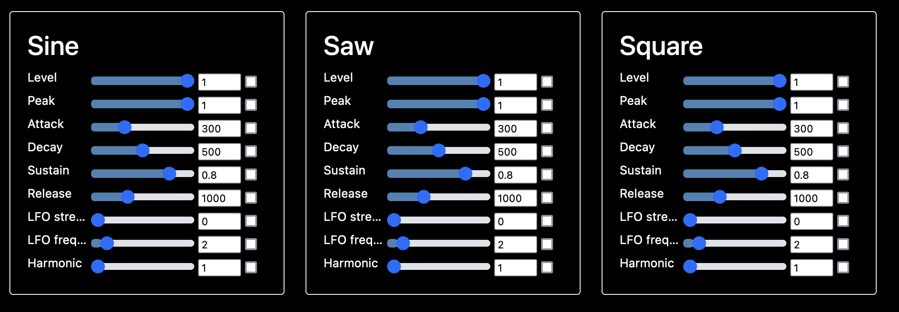

# Winslow Synthesizer

This is a project for making funny sounds with Go.


## Installation
Getting audio drivers to work properly with Golang has proven tricky.

This setup is working for me on an M1 Mac:
```
export LIBRARY_PATH_TO_USE="/usr/local/lib/:`pwd`/portaudio/lib/.libs"
export LIBRARY_PATH="$LIBRARY_PATH_TO_USE"
export CGO_CFLAGS="-I`pwd`/portaudio/include"
export PKG_CONFIG_PATH=`pwd`/portaudio
export CGO_ENABLED=1
export CC=gcc

go run -exec "env DYLD_LIBRARY_PATH=$LIBRARY_PATH_TO_USE" main.go
```

### Input Devices
If you have a MIDI device connected, that will automatically be picked up.
Otherwise, you can use the top two rows of keys on your QWERTY keyboard
when focused on the browser.

## Building Synths

### Generators
> Everything is a `Generator`

A `Generator` is a Go interface for generating signals. The most important function a `Generator` must provide is:

```go
GetValue(timeSinceAttack, releaseTime uint64) float32
```

which tells the caller exactly what value it takes at a given time.

Built-in `Generator`s include:
* `Constant`
* `Oscillator`
* `ADSR`
* `Noise`
* `Harmonic`
* `Delay`

Often the inputs to a `Generator` are other `Generator`s. For instance, the `Oscillator` looks like this:
```go
type Oscillator struct {
    Info          Info
    Amplitude     Generator
    Frequency     Generator
    Phase         Generator
    Bias          Generator
    Shape         OscillatorShape
    DropOnRelease bool
}
```

If you're constructing a `Generator` with numerical inputs, it's recommended you make them
`Generator`s instead of, say, `int`s or `float32`s.

### Constants
The most basic kind of `Generator` is a `Constant`. A `Constant` gives off a single value. But
importantly, they're also used to drive user inputs.

For example, we might define a constant like this:
```go
sineAmplitude := Constant{
  Info: {
    Name: "Amplitude",
    Group: "Sine",
  },
  Value: 1.0,
  Min: 0.0,
  Max: 1.0,
  Step: 0.01,
}
```

We can then use this `Constant` as an input to another Generator:
```go
osc := Oscillator{
  Amplitude: sineAmplitude,
}
```

This will automatically create a slider in the UI which allows the user to
alter the constant on-the-fly. The `Name` field controls the label on the slider,
while the `Group` field controls which other `Constant`s it's grouped with.


