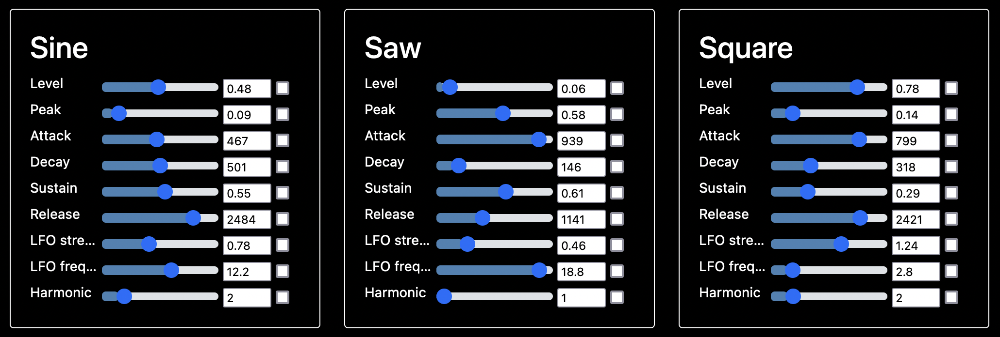

# Winslow Synth

**Make funny sounds with Go.**


## Installation
Getting audio drivers to work properly with Golang has proven tricky.

This setup is working for me on an M1 Mac:
```
export LIBRARY_PATH_TO_USE="/usr/local/lib/:`pwd`/portaudio/lib/.libs"
export LIBRARY_PATH="$LIBRARY_PATH_TO_USE"
export CGO_CFLAGS="-I`pwd`/portaudio/include"
export PKG_CONFIG_PATH=`pwd`/portaudio
export CGO_ENABLED=1
export CC=gcc

go run -exec "env DYLD_LIBRARY_PATH=$LIBRARY_PATH_TO_USE" main.go
```

### Input Devices
If you have a MIDI device connected, that will automatically be picked up.
Otherwise, you can use the top two rows of keys on your QWERTY keyboard
when focused on the browser.

## User Interface


The UI is fairly simple for now. It contains:
* A live visualization of the audio buffer
* A visualization of the waveform (zooming in on a stable part of the audio buffer)
* An instrument selector
* Controls for every part of the current instrument
* A button to randomize the values for each control

## Building Synths

### Generators
> Everything is a `Generator`

A `Generator` is a Go interface for generating signals. The most important function a `Generator` must provide is:

```go
GetValue(timeSinceAttack, releaseTime uint64) float32
```

which tells the caller exactly what value it takes at a given time.

Built-in `Generator`s include:
* `Constant`
* `Oscillator`
* `ADSR`
* `Noise`
* `Harmonic`
* `Delay`

Often the inputs to a `Generator` are other `Generator`s. For instance, the `Oscillator` looks like this:
```go
type Oscillator struct {
    Info          Info
    Amplitude     Generator
    Frequency     Generator
    Phase         Generator
    Bias          Generator
    Shape         OscillatorShape
    DropOnRelease bool
}
```

If you're constructing a `Generator` with numerical inputs, it's recommended you make them
`Generator`s instead of, say, `int`s or `float32`s.

### Constants
The most basic kind of `Generator` is a `Constant`. A `Constant` gives off a single value. But
importantly, they're also used to drive user inputs.

For example, we might define a constant like this:
```go
sineAmplitude := Constant{
  Info: {
    Name: "Amplitude",
    Group: "Sine",
  },
  Value: 1.0,
  Min: 0.0,
  Max: 1.0,
  Step: 0.01,
}
```

We can then use this `Constant` as an input to another Generator:
```go
osc := Oscillator{
  Amplitude: sineAmplitude,
}
```

This will automatically create a slider in the UI which allows the user to
alter the constant on-the-fly. The `Name` field controls the label on the slider,
while the `Group` field controls which other `Constant`s it's grouped with.



### Frequency
Any `Constant` named `Frequency` has a special place in Winslow - it is set not via a slider
in the UI, but by keys pressed on a MIDI or QWERTY keyboard.

You can place a `Frequency` constant anywhere in your instrument to respond to keys being hit.

## TODO
### Must-Have
* Implement filters
* FFT visualization
* Input from MIDI files
* Support pitch-bend MIDI input
* Moar instruments
* Make this consumable as an external package
* Asynchronous `.wav` generation for expensive sounds

### Long Term
* YAML configuration for building instruments
* In-browser instrument builder
* In-browser live keyboard
* In-browser sequencer

## Implementation Notes
Winslow makes a lot of use of tricky Golang concepts, like channels, goroutines, pointers, and
(gasp) reflection. Because of this, it can be a little finicky.

### Architecture

The core component is the `MusicPlayer`, which is where input meets output.

`MusicPlayer.Output` contains a circular buffer where audio data is stored.

`MusicPlayer.Start()` takes in a `chan input.InputKey`, which represents a series of
raw input events - for now, just keys getting attacked and released. It tracks these
in a `Sequence`, which pairs attacks/releases together into a single `Event`.

`MusicPlayer.Sequence.Instrument` is the `Generator` currently being used to play music.

Each `Event` comes with its own copy of the `Generator` being used as your current instrument,
with its `Frequency` set accordingly. You can think of each `Event` as a distinct physical
process (e.g. a string getting plucked).

Every 10ms, the `MusicPlayer` asks its `Sequence` for the next chunk of audio data, and
puts it into `MusicPlayer.Output`, where it is eventually read by `PortAudio` and sent
to your speakers.

### Mixing
At any point in time, Winslow has to mix data from a variable number of `Event`s together
into a single audio buffer. Each `Event` generates an audio buffer in `[-1.0, 1.0]`, and
these need to be combined in turn to create an audio buffer also in `[-1.0, 1.0]`.

Currently, Winslow simply adds all the Event buffers together. In practice, this leads to some
clipping (values that are greater than 1.0 or less than -1.0), but not much.

There's an experimental mixer `MixBuffersNoOverflow` which ensures there's no clipping,
but changes the signal a bit.

There's probably something smarter we could be doing here...

### Performance
On my machine, things start to get hairy at around 100 `Generator`s. That could be one note
on a big complicated instrument, or 100 rapid keypresses on a basic Sine oscillator.

Winslow try to degrade gracefully in this situation - it will begin to downsample the instrument,
interpolating intermediate samples.

You can trigger this by opening up a large instrument and playing multiple chords in quick
succession - eventually you will hear the audio degrade and start to crackle.

I believe this is a pretty hard limitation of the current system. I'm not sure how well it performs
relative to other digital synths, but my guess is not well.
